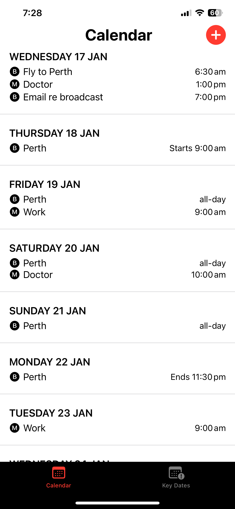
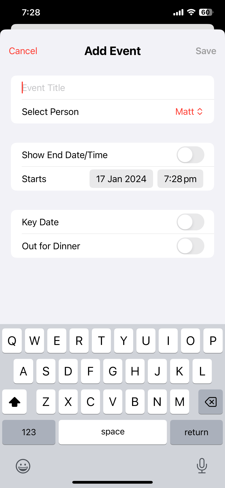
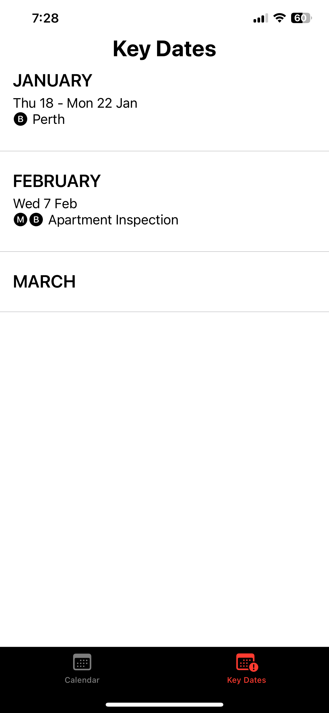

# Hoppitt Calendar

Hoppitt Calendar simplifies the scheduling challenges faced by shared households by providing a centralised platform for all members to easily plan and track their activities. With custom attributes tailored to the unique needs of the household, events are seamlessly synced in real-time, giving everyone an up-to-date view of each other's week. This app fosters better coordination and smoother day-to-day living for shared homes.

## Features

**Centralised Household Calendar**: A single platform where all household members can add and view events.

**Custom Attributes**: Tailor events to the household's unique needs, such as chore assignments, shared expenses, or meal planning.

**Real-time Syncing**: Changes to the calendar are instantly reflected for all users.

**Push Notifications**: Get notified when an event is added, modified, or deleted.

**Seamless SwiftUI Experience**: A modern, intuitive interface designed with SwiftUI.

**AWS-Powered Backend**: Events are stored securely in DynamoDB, and SNS handles real-time notifications.

## Tech Stack

**Frontend**: SwiftUI

**Backend**: AWS DynamoDB (Event Storage), AWS SNS (Push Notifications)

## Screenshots

## Demo Video

## Installation

1. Clone the repository: `git clone https://github.com/yourusername/hoppitt-calendar.git`

2. Open the project in Xcode.

3. Run the app on a simulator or device.
